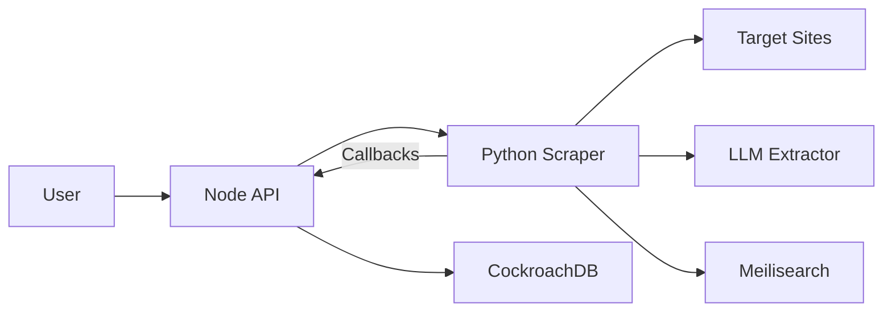
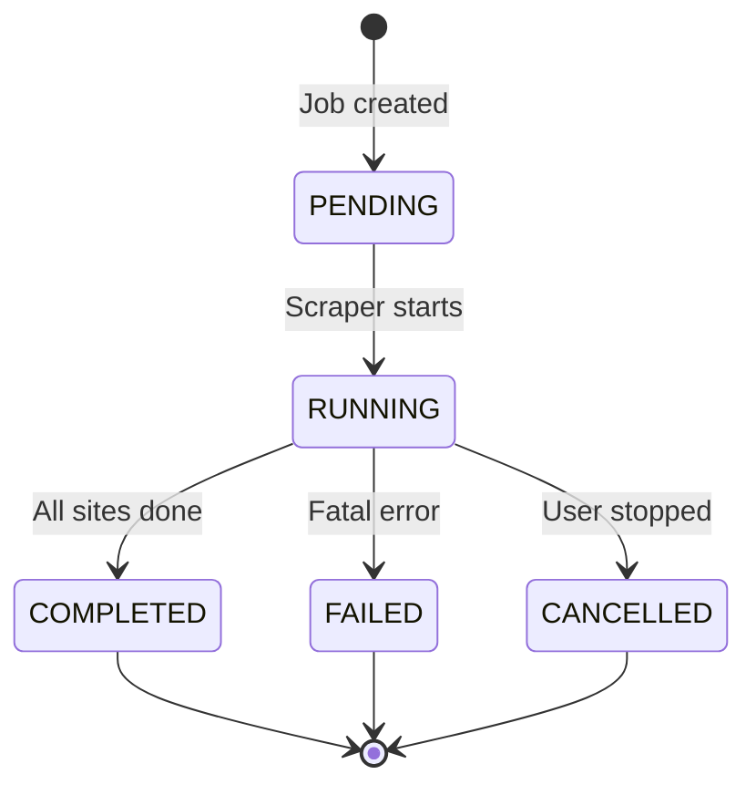

Realtors' Practice scrapes property listings from multiple Nigerian real estate sites using a Python microservice built with Playwright, BeautifulSoup, and LLM fallbacks.

## Architecture Overview

The scraping system consists of three layers:

<Steps>
  <Step title="Node.js API (Backend)">
    Creates scrape jobs, monitors progress, and stores results in CockroachDB.
  </Step>
  <Step title="Python Scraper (Microservice)">
    Fetches HTML, extracts data, and validates properties using Playwright + BeautifulSoup.
  </Step>
  <Step title="Callback System">
    Reports progress, logs, and results back to the API server via HTTP callbacks.
  </Step>
</Steps>



## Scrape Job Types

The system supports four job types (schema.prisma:66-71):

<CardGroup cols={2}>
  <Card title="Passive Bulk" icon="database">
    **PASSIVE_BULK**: Scrapes all listings from configured sites on a schedule. Used for building the initial database.
  </Card>
  <Card title="Active Intent" icon="zap">
    **ACTIVE_INTENT**: User-triggered scrape based on a specific search query (e.g., "3 bedroom in Lekki").
  </Card>
  <Card title="Rescrape" icon="rotate">
    **RESCRAPE**: Re-fetches existing properties to detect price changes or status updates.
  </Card>
  <Card title="Scheduled" icon="clock">
    **SCHEDULED**: Automated scrapes run at configured intervals (e.g., daily at 3 AM).
  </Card>
</CardGroup>

## Starting a Scrape Job

Jobs are created via the `/api/scrape/jobs` endpoint (scrape.controller.ts:6-23):

```typescript
POST /api/scrape/jobs
{
  "siteIds": ["cm5a1b2c3d4e5f6g7h8i9j0k"],
  "type": "ACTIVE_INTENT",
  "maxListingsPerSite": 100,
  "searchQuery": "3 bedroom flat in Lekki",
  "parameters": {
    "minPrice": 5000000,
    "maxPrice": 30000000
  }
}
```

### Request Parameters

| Field | Type | Required | Description |
|-------|------|----------|-------------|
| `siteIds` | string[] | Yes | Array of Site IDs to scrape |
| `type` | ScrapeJobType | Yes | Job type (see above) |
| `maxListingsPerSite` | number | No | Limit per site (default: 100) |
| `searchQuery` | string | No | Natural language query for ACTIVE_INTENT |
| `parameters` | object | No | Additional filters (price, bedrooms, etc.) |

## Scraping Pipeline

Each job runs through a 7-stage pipeline (app.py:167-321):

<Steps>
  <Step title="Fetch listing pages">
    `AdaptiveFetcher` retrieves search result pages with rate limiting and retry logic.
  </Step>
  <Step title="Extract listing URLs">
    `UniversalExtractor` uses CSS selectors to find property links (universal_extractor.py:40-64).
  </Step>
  <Step title="Fetch detail pages">
    Each listing URL is fetched (with JS rendering if required).
  </Step>
  <Step title="Extract property data">
    Selectors pull 85+ fields from the HTML. LLM fallback fills gaps (app.py:232-241).
  </Step>
  <Step title="Parse & normalize">
    Prices, locations, and features are standardized.
  </Step>
  <Step title="Validate & deduplicate">
    Properties get quality scores and hash-based deduplication.
  </Step>
  <Step title="Enrich & geocode">
    Missing coordinates are geocoded via Google Maps API.
  </Step>
</Steps>

## Adaptive Fetching

The `AdaptiveFetcher` automatically switches between HTTP and Playwright based on site requirements:

<Accordion title="HTTP Mode" icon="bolt">
  **Fast & lightweight** for sites that don't require JavaScript. Uses `httpx` with custom headers and cookies.
</Accordion>

<Accordion title="Playwright Mode" icon="browser">
  **Full browser rendering** for dynamic sites. Supports waiting for selectors, infinite scroll, and lazy-loaded images.
</Accordion>

```python
# Site configuration (schema.prisma:149-183)
model Site {
  requiresBrowser Boolean @default(false)
  paginationType  String  @default("auto")
  maxPages        Int     @default(30)
  customHeaders   Json?
}
```

<Tip>
Sites with `requiresBrowser: true` automatically use Playwright, while others default to HTTP for speed.
</Tip>

## CSS Selector Configuration

Each site has a `selectors` JSON field defining extraction rules (universal_extractor.py:20-39):

```json
{
  "title": "h1.property-title",
  "price": ".price-text",
  "description": ".property-description",
  "location": ".property-location",
  "bedrooms": ".bed-count",
  "bathrooms": ".bath-count",
  "images": "img.property-image::attr(src)",
  "agent_name": ".agent-name",
  "features": ".feature-item"
}
```

### Attribute Extraction

Use `::attr(name)` to extract attributes instead of text:

```json
{
  "images": "img.gallery::attr(src)",
  "listing_link": "a.property-card::attr(href)"
}
```

## LLM Fallback Extraction

If crucial fields are missing (price, bedrooms, location), the scraper invokes an LLM to parse the page text (app.py:232-241):

```python
if not raw_data.get("price_text") or not raw_data.get("bedrooms"):
    await report_log(job_id, "DEBUG", "Missing data, attempting LLM fallback...")
    from extractors.llm_extractor import extract_with_llm
    
    soup = BeautifulSoup(listing_html, "lxml")
    page_text = soup.get_text(separator=" ", strip=True)
    
    raw_data = extract_with_llm(page_text, raw_data)
```

<Warning>
LLM extraction is slow and expensive. Only use for sites with unpredictable HTML structures.
</Warning>

## Deduplication

Properties are hashed using `title + location + price` to detect duplicates (pipeline/deduplicator.py):

```python
if deduplicator.is_duplicate(validated):
    await report_log(job_id, "DEBUG", f"Duplicate skipped: {validated.get('title')[:50]}")
    continue
```

Duplicates are counted but not saved to the database.

## Progress Reporting

The scraper sends real-time updates via HTTP callbacks:

```python
await report_progress(
    job_id,
    processed=len(all_properties) + len(site_properties),
    total=request.maxListingsPerSite * len(request.sites),
    current_site=site.name,
)
```

Users see live progress in the scrape jobs dashboard:

<Frame>
  
</Frame>

## Logging System

All scrape events are logged to the `ScrapeLog` table with levels:

<CodeGroup>
```typescript DEBUG
Detailed extraction steps, selector matches, LLM prompts
```

```typescript INFO
Site started, listings found, job completed
```

```typescript WARN
Empty responses, missing fields, snapshots saved
```

```typescript ERROR
Fetch failures, parsing errors, callback failures
```
</CodeGroup>

Logs are queryable via `/api/scrape/logs` with filters:

```typescript
GET /api/scrape/logs?jobId=abc123&level=ERROR&search=timeout
```

## Scrape Job States

Jobs transition through these states (schema.prisma:58-64):



### Stopping Jobs

Users can stop running jobs via the UI (scrape.controller.ts:78-86):

```typescript
POST /api/scrape/jobs/{jobId}/stop
```

The scraper checks `redis_client.exists(f"job:stop:{job_id}")` before each page fetch (app.py:178-180).

## Pagination Strategies

The scraper supports three pagination types (app.py:323-347):

<Tabs>
  <Tab title="URL Parameter">
    ```
    https://site.com/properties?page=2
    https://site.com/properties?page=3
    ```
    Config: `{ "paginationType": "url_param", "paginationConfig": { "param": "page", "startFrom": 1 } }`
  </Tab>
  
  <Tab title="Path Segment">
    ```
    https://site.com/properties/page/2
    https://site.com/properties/page/3
    ```
    Config: `{ "paginationType": "path_segment", "paginationConfig": { "suffix": "/page/{page}" } }`
  </Tab>
  
  <Tab title="Offset">
    ```
    https://site.com/properties?offset=0
    https://site.com/properties?offset=20
    ```
    Config: `{ "paginationType": "offset", "paginationConfig": { "param": "offset", "perPage": 20 } }`
  </Tab>
</Tabs>

## HTML Snapshots

When extraction fails, the scraper saves raw HTML for debugging (app.py:55-66):

```python
_save_snapshot(site.name, listing_url, listing_html)
await report_log(job_id, "WARN", f"No data extracted from {listing_url}, snapshot saved")
```

Snapshots are stored in `config.raw_html_dir` and auto-purged after `config.raw_html_retention_days`.

<Tip>
Use snapshots to refine CSS selectors or debug LLM extraction prompts.
</Tip>

## Active Intent Search

When users click "Search the Web" (active-scrape-trigger.tsx:37-54), the system:

<Steps>
  <Step title="Creates ACTIVE_INTENT job">
    With `searchQuery` set to user's query.
  </Step>
  <Step title="Parses query with NLP">
    Extracts location, bedrooms, price range (extractors/universal_nlp.py).
  </Step>
  <Step title="Scrapes targeted listings">
    Only fetches properties matching the parsed filters.
  </Step>
  <Step title="Merges with existing data">
    New listings are indexed in Meilisearch and shown in results.
  </Step>
</Steps>

```tsx
// active-scrape-trigger.tsx:37-54
<button
  onClick={onTriggerScrape}
  disabled={isLoading}
  className="..."
>
  {isLoading ? (
    <><Loader2 className="animate-spin" /> Searching...</>
  ) : (
    <><Zap /> Search the Web</>
  )}
</button>
```

## Performance Metrics

Each job tracks these statistics (schema.prisma:367-371):

| Metric | Description |
|--------|-------------|
| `totalListings` | Total properties fetched |
| `newListings` | New properties added to DB |
| `updatedListings` | Existing properties with changes |
| `duplicates` | Skipped duplicates |
| `errors` | Failed fetches or extractions |

## Next Steps

<CardGroup cols={2}>
  <Card title="Site Management" icon="gear" href="/admin/sites">
    Configure scraper sites and selectors.
  </Card>
  <Card title="AI Intelligence" icon="brain" href="/features/ai-intelligence">
    Learn how natural language queries are parsed.
  </Card>
  <Card title="Version Tracking" icon="clock-rotate-left" href="/features/version-history">
    Track property changes over time.
  </Card>
  <Card title="Quality Scoring" icon="star" href="/customize/quality-score">
    Understand property quality calculations.
  </Card>
</CardGroup>