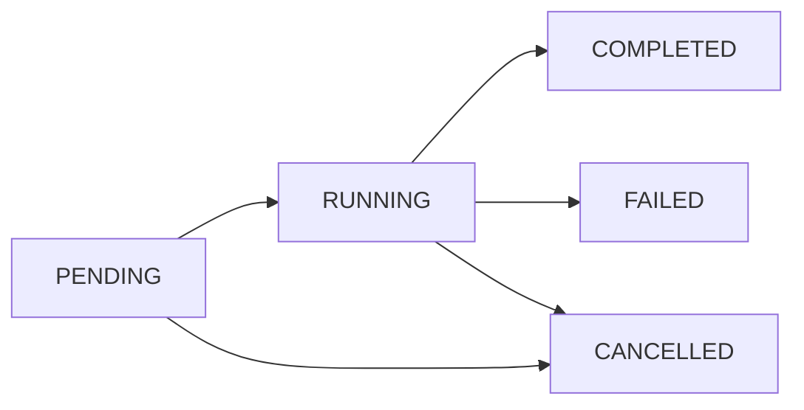

## Overview

Realtors' Practice uses an intelligent scraping system to collect property data from multiple Nigerian real estate websites. The scraper runs as a separate Python microservice using Playwright and BeautifulSoup, coordinated through the Node.js backend.

<Warning>
  **Admin and Editor Roles Required**
  
  Only users with Admin or Editor roles can start and manage scraping jobs. Viewers have read-only access to completed data.
</Warning>

## Scrape Job Types

The platform supports four types of scraping jobs, each optimized for different scenarios:

<CardGroup cols={2}>
  <Card title="PASSIVE_BULK" icon="database">
    **Background Collection**
    
    Runs on schedule to continuously refresh the property database. Low priority, processes large volumes of listings overnight.
    
    - Priority: 7 (lowest)
    - Use case: Regular database updates
    - Scheduled: Daily or weekly
  </Card>
  
  <Card title="ACTIVE_INTENT" icon="bolt">
    **On-Demand Search**
    
    High-priority scraping triggered by user searches. Returns results quickly when specific criteria are requested.
    
    - Priority: 1 (highest)
    - Use case: User-initiated searches
    - Processed: Immediately
  </Card>
  
  <Card title="RESCRAPE" icon="rotate">
    **Property Refresh**
    
    Updates existing property records to detect price changes, status updates, and new photos.
    
    - Priority: 3 (medium)
    - Use case: Verify current availability
    - Target: Known listing URLs
  </Card>
  
  <Card title="SCHEDULED" icon="clock">
    **Automated Maintenance**
    
    Periodic background jobs for data quality and site health checks.
    
    - Priority: 7 (low)
    - Use case: System maintenance
    - Frequency: Hourly or daily
  </Card>
</CardGroup>

## Starting a Scrape Job

<Steps>
  <Step title="Select target sites">
    Choose which real estate websites to scrape from the available site list. Each site has specific scrapers configured.
  </Step>
  
  <Step title="Configure job parameters">
    Set:
    - **Job type**: PASSIVE_BULK, ACTIVE_INTENT, RESCRAPE, or SCHEDULED
    - **Max listings per site**: Limit results (default: 100)
    - **Search query** (optional): Natural language query to guide scraping
    - **Parameters** (optional): Site-specific configuration
  </Step>
  
  <Step title="Submit the job">
    The system creates a database record and dispatches the job to the Python scraper via Redis/Celery queue or direct HTTP.
  </Step>
  
  <Step title="Monitor progress">
    Track job status in real-time through the UI or via Socket.io events.
  </Step>
</Steps>

### API Example: Start a Scrape Job

```bash Request
curl -X POST https://api.realtorspractice.com/api/scrape/jobs \
  -H "Authorization: Bearer YOUR_JWT_TOKEN" \
  -H "Content-Type: application/json" \
  -d '{
    "siteIds": ["site_propertypro", "site_tolet", "site_nigeria_property"],
    "type": "ACTIVE_INTENT",
    "maxListingsPerSite": 50,
    "searchQuery": "3 bedroom flat lekki",
    "parameters": {
      "minPrice": 50000000,
      "maxPrice": 100000000
    }
  }'
```

```json Response
{
  "success": true,
  "data": {
    "id": "clj1234567890",
    "type": "ACTIVE_INTENT",
    "status": "RUNNING",
    "siteIds": ["site_propertypro", "site_tolet", "site_nigeria_property"],
    "sites": [
      {"id": "site_propertypro", "name": "PropertyPro.ng", "baseUrl": "https://propertypro.ng"},
      {"id": "site_tolet", "name": "ToLet.com.ng", "baseUrl": "https://tolet.com.ng"},
      {"id": "site_nigeria_property", "name": "NigeriaPropertyCentre", "baseUrl": "https://nigeriapropertycentre.com"}
    ],
    "parameters": {
      "minPrice": 50000000,
      "maxPrice": 100000000
    },
    "searchQuery": "3 bedroom flat lekki",
    "totalListings": 0,
    "newListings": 0,
    "updatedListings": 0,
    "duplicates": 0,
    "errors": 0,
    "startedAt": "2026-03-11T11:30:00Z",
    "completedAt": null,
    "createdAt": "2026-03-11T11:30:00Z"
  },
  "message": "Scrape job started"
}
```

<Note>
  **Site IDs** must reference enabled sites in your database. Use the Sites API to fetch available options before starting a job.
</Note>

## Job Status Lifecycle

Scrape jobs progress through the following states:



<AccordionGroup>
  <Accordion title="PENDING" icon="clock">
    Job created and queued, waiting for the scraper to pick it up. Usually transitions to RUNNING within seconds.
  </Accordion>
  
  <Accordion title="RUNNING" icon="play">
    Scraper is actively collecting data from target sites. Progress updates are streamed via Socket.io.
  </Accordion>
  
  <Accordion title="COMPLETED" icon="check">
    Job finished successfully. All scraped properties have been processed and added to the database.
  </Accordion>
  
  <Accordion title="FAILED" icon="xmark">
    Job encountered unrecoverable errors. Check logs for details.
  </Accordion>
  
  <Accordion title="CANCELLED" icon="ban">
    Job was manually stopped by a user or system administrator.
  </Accordion>
</AccordionGroup>

## Monitoring Jobs

### List All Jobs

Retrieve scrape jobs with filtering and pagination.

```bash Request
curl -X GET "https://api.realtorspractice.com/api/scrape/jobs?page=1&limit=20&status=COMPLETED" \
  -H "Authorization: Bearer YOUR_JWT_TOKEN"
```

```json Response
{
  "success": true,
  "data": [
    {
      "id": "clj1234567890",
      "type": "ACTIVE_INTENT",
      "status": "COMPLETED",
      "siteIds": ["site_propertypro", "site_tolet"],
      "sites": [
        {"id": "site_propertypro", "name": "PropertyPro.ng"},
        {"id": "site_tolet", "name": "ToLet.com.ng"}
      ],
      "createdBy": {
        "id": "clx9876543210",
        "email": "admin@company.com",
        "firstName": "Admin"
      },
      "totalListings": 87,
      "newListings": 23,
      "updatedListings": 0,
      "duplicates": 64,
      "errors": 2,
      "startedAt": "2026-03-11T11:30:00Z",
      "completedAt": "2026-03-11T11:37:42Z",
      "durationMs": 462000,
      "_count": {
        "logs": 145
      }
    }
  ],
  "page": 1,
  "limit": 20,
  "total": 342
}
```

<Tip>
  **Filter Options:**
  - `status`: PENDING, RUNNING, COMPLETED, FAILED, CANCELLED
  - `page`: Page number (default: 1)
  - `limit`: Results per page (default: 20, max: 100)
</Tip>

### Get Job Details

Fetch complete information about a specific job including recent logs.

```bash Request
curl -X GET https://api.realtorspractice.com/api/scrape/jobs/clj1234567890 \
  -H "Authorization: Bearer YOUR_JWT_TOKEN"
```

```json Response
{
  "success": true,
  "data": {
    "id": "clj1234567890",
    "type": "ACTIVE_INTENT",
    "status": "COMPLETED",
    "siteIds": ["site_propertypro", "site_tolet"],
    "sites": [
      {
        "id": "site_propertypro",
        "name": "PropertyPro.ng",
        "baseUrl": "https://propertypro.ng"
      }
    ],
    "createdBy": {
      "id": "clx9876543210",
      "email": "admin@company.com",
      "firstName": "Admin"
    },
    "totalListings": 87,
    "newListings": 23,
    "duplicates": 64,
    "errors": 2,
    "startedAt": "2026-03-11T11:30:00Z",
    "completedAt": "2026-03-11T11:37:42Z",
    "durationMs": 462000,
    "logs": [
      {
        "id": "cll1111111111",
        "level": "INFO",
        "message": "Scraping PropertyPro.ng completed",
        "details": {
          "listingsFound": 87,
          "pagesProcessed": 5
        },
        "timestamp": "2026-03-11T11:37:00Z"
      }
    ]
  }
}
```

### Stop a Running Job

Cancel a job that's currently in progress.

```bash Request
curl -X POST https://api.realtorspractice.com/api/scrape/jobs/clj1234567890/stop \
  -H "Authorization: Bearer YOUR_JWT_TOKEN"
```

```json Response
{
  "success": true,
  "data": {
    "id": "clj1234567890",
    "status": "CANCELLED",
    "completedAt": "2026-03-11T11:35:00Z"
  },
  "message": "Job stopped"
}
```

<Warning>
  Stopping a job is immediate but not instantaneous. The scraper may process a few more pages before fully terminating. Partial results are still saved to the database.
</Warning>

## Scrape Logs

Logs provide detailed insight into scraper operations, errors, and progress.

### Log Levels

- **INFO**: Normal operation messages ("Started scraping site X")
- **WARN**: Non-critical issues ("Slow response from site")
- **ERROR**: Scraping errors ("Failed to parse listing page")
- **DEBUG**: Detailed diagnostic information

### View Job Logs

```bash Request
curl -X GET "https://api.realtorspractice.com/api/scrape/logs?jobId=clj1234567890&page=1&limit=25" \
  -H "Authorization: Bearer YOUR_JWT_TOKEN"
```

```json Response
{
  "success": true,
  "data": [
    {
      "id": "cll2222222222",
      "jobId": "clj1234567890",
      "siteId": "site_propertypro",
      "level": "INFO",
      "message": "Starting scrape for PropertyPro.ng",
      "details": {
        "maxPages": 30,
        "listingSelector": "a.property-link"
      },
      "timestamp": "2026-03-11T11:30:05Z",
      "job": {
        "id": "clj1234567890",
        "status": "RUNNING",
        "type": "ACTIVE_INTENT"
      }
    },
    {
      "id": "cll3333333333",
      "jobId": "clj1234567890",
      "siteId": "site_propertypro",
      "level": "ERROR",
      "message": "Failed to extract price from listing",
      "details": {
        "url": "https://propertypro.ng/property/abc123",
        "error": "Price selector not found"
      },
      "timestamp": "2026-03-11T11:32:14Z",
      "job": {
        "id": "clj1234567890",
        "status": "RUNNING",
        "type": "ACTIVE_INTENT"
      }
    }
  ],
  "page": 1,
  "limit": 25,
  "total": 145
}
```

### Filter Logs

Search and filter logs by multiple criteria:

```bash Request
curl -X GET "https://api.realtorspractice.com/api/scrape/logs" \
  -H "Authorization: Bearer YOUR_JWT_TOKEN" \
  --data-urlencode "level=ERROR" \
  --data-urlencode "siteId=site_propertypro" \
  --data-urlencode "from=2026-03-11T00:00:00Z" \
  --data-urlencode "to=2026-03-11T23:59:59Z" \
  --data-urlencode "search=price"
```

<Note>
  **Log Filter Parameters:**
  - `jobId`: Filter by specific job
  - `level`: INFO, WARN, ERROR, DEBUG
  - `siteId`: Filter by site
  - `from` / `to`: Date range (ISO 8601 format)
  - `search`: Text search in message field
  - `page` / `limit`: Pagination
</Note>

## Real-Time Updates

The platform broadcasts scrape progress via Socket.io for live monitoring.

### Socket Events

<CardGroup cols={2}>
  <Card title="scrape:progress" icon="chart-line">
    Progress updates during job execution
    
    ```json
    {
      "jobId": "clj1234567890",
      "processed": 45,
      "total": 100,
      "currentSite": "PropertyPro.ng",
      "message": "Processing page 3 of 5"
    }
    ```
  </Card>
  
  <Card title="scrape:log" icon="file-lines">
    Individual log entries as they occur
    
    ```json
    {
      "jobId": "clj1234567890",
      "level": "INFO",
      "message": "Found 87 listings",
      "details": {...}
    }
    ```
  </Card>
  
  <Card title="scrape:complete" icon="circle-check">
    Job completion with final statistics
    
    ```json
    {
      "jobId": "clj1234567890",
      "totalListings": 87,
      "newListings": 23,
      "duplicates": 64,
      "errors": 2
    }
    ```
  </Card>
  
  <Card title="scrape:error" icon="circle-xmark">
    Job failure notification
    
    ```json
    {
      "jobId": "clj1234567890",
      "error": "Unable to connect to scraper"
    }
    ```
  </Card>
</CardGroup>

### Connect to Socket.io

```javascript Example Client
import io from 'socket.io-client';

const socket = io('https://api.realtorspractice.com', {
  auth: { token: 'YOUR_JWT_TOKEN' }
});

socket.on('scrape:progress', (data) => {
  console.log(`Progress: ${data.processed}/${data.total}`);
  updateProgressBar(data.processed, data.total);
});

socket.on('scrape:complete', (data) => {
  console.log(`Job complete: ${data.newListings} new properties`);
  refreshPropertyList();
});

socket.on('scrape:error', (data) => {
  console.error(`Job failed: ${data.error}`);
  showErrorNotification(data.error);
});
```

## Job Statistics

Each completed job provides comprehensive statistics:

- **totalListings**: Total properties found during scrape
- **newListings**: Properties added to database (first time seen)
- **updatedListings**: Existing properties with changes detected
- **duplicates**: Properties already in database (no changes)
- **errors**: Number of errors encountered
- **durationMs**: Total execution time in milliseconds

```json Example Statistics
{
  "totalListings": 87,
  "newListings": 23,
  "updatedListings": 0,
  "duplicates": 64,
  "errors": 2,
  "durationMs": 462000
}
```

<Tip>
  **Performance Metrics:**
  - Average scrape speed: ~5-10 properties per second
  - Typical job duration: 2-10 minutes depending on site count
  - Duplicate detection: Instant via property hash matching
</Tip>

## Scraper Architecture

Understanding the system helps troubleshoot issues:

<Steps>
  <Step title="Job Dispatch">
    Backend creates database record and sends job to Python scraper via:
    - **Redis/Celery** (production): Queued tasks with priority
    - **Direct HTTP** (development): Immediate POST to scraper API
  </Step>
  
  <Step title="Site Processing">
    Python scraper (Playwright + BeautifulSoup):
    - Navigates to each site's listing pages
    - Handles JavaScript rendering when needed
    - Extracts property data using site-specific selectors
    - Processes pagination up to `maxPages` limit
  </Step>
  
  <Step title="Data Validation">
    Scraped data is validated and normalized:
    - Required fields checked
    - Prices parsed and converted
    - Location data geocoded
    - Images downloaded and validated
  </Step>
  
  <Step title="Callback to Backend">
    Scraper sends results back to backend via internal API:
    - Property data batches
    - Progress updates
    - Error reports
    - Final statistics
  </Step>
  
  <Step title="Database Update">
    Backend processes results:
    - Generates property hash for duplicate detection
    - Creates or updates property records
    - Tracks version history for changes
    - Updates site health metrics
  </Step>
</Steps>

## Best Practices

<CardGroup cols={2}>
  <Card title="Choose Appropriate Type" icon="list-check">
    Use ACTIVE_INTENT for user requests, PASSIVE_BULK for background updates, RESCRAPE for verification.
  </Card>
  <Card title="Limit Results" icon="gauge">
    Set reasonable `maxListingsPerSite` to avoid overwhelming the system (50-200 recommended).
  </Card>
  <Card title="Monitor Site Health" icon="heart-pulse">
    Check site health scores before scraping. Disabled or failing sites won't process.
  </Card>
  <Card title="Review Logs" icon="magnifying-glass">
    Check ERROR-level logs after completion to identify data quality issues.
  </Card>
  <Card title="Avoid Duplicate Jobs" icon="ban">
    Don't start multiple identical jobs simultaneously. Check for existing RUNNING jobs first.
  </Card>
  <Card title="Respect Scheduling" icon="calendar">
    Schedule PASSIVE_BULK jobs during off-peak hours to minimize impact on site servers.
  </Card>
</CardGroup>

## Troubleshooting

<AccordionGroup>
  <Accordion title="Job stuck in PENDING">
    Possible causes:
    - Scraper service is down
    - Redis queue is not being processed
    - Database connection issues
    
    Check scraper health endpoint and Redis connectivity.
  </Accordion>
  
  <Accordion title="Job fails immediately">
    Common reasons:
    - Invalid site IDs (sites don't exist or are disabled)
    - Scraper can't reach target websites
    - Missing scraper configuration
    
    Review the first ERROR log entry for specific details.
  </Accordion>
  
  <Accordion title="High error count">
    May indicate:
    - Target site structure changed (selectors outdated)
    - Network issues or rate limiting
    - Invalid property data (missing required fields)
    
    Filter logs by level=ERROR to identify patterns.
  </Accordion>
  
  <Accordion title="Few or no new listings">
    Expected if:
    - Properties were already scraped recently (duplicates)
    - Search criteria are too narrow
    - Target site has limited new inventory
    
    Check `duplicates` count in statistics - high number is normal.
  </Accordion>
  
  <Accordion title="Can't stop a job">
    Verify:
    - Job status is RUNNING or PENDING
    - You have Admin/Editor permissions
    - Scraper service is responsive
    
    If scraper is down, job will eventually timeout and fail.
  </Accordion>
</AccordionGroup>

## Next Steps

<CardGroup cols={2}>
  <Card title="Data Explorer" icon="chart-line" href="/guides/data-explorer">
    Analyze scraped property data with visualizations
  </Card>
  <Card title="Search Filters" icon="filter" href="/guides/search-filters">
    Use scraped data with advanced search
  </Card>
  <Card title="Notifications" icon="bell" href="/guides/notifications">
    Get notified when scrape jobs complete
  </Card>
  <Card title="API Reference" icon="code" href="/api/scraping/jobs">
    Complete scraping API documentation
  </Card>
</CardGroup>